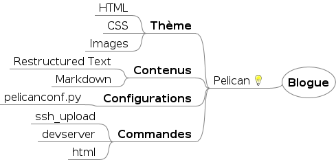

# QuébecPython: première édition

## Présentation de Pelican

---

# Qui suis-je ?

* Je pars en voyage et j'apporte: Un des recueils de poésie de Gaston Miron
* Chanson que j'écouterai éternellement: *Au long de tes hanches* de Louis-Jean Cormier
* Jeu vidéo FPS préféré: BZFlag
* Site web: bernardchhun.com

---

# Qu'est-ce que c'est ?

Un générateur de site web/blogue

---

# Comment ça fonctionne ?

---

# Pourquoi l'utiliser ?

* Pas de base de données
* Facilité d'hébergement
* Contenu en *Markdown* <small>a.k.a. pas de promesses mensongères avec un wysiwyg</small>

---

# Pourquoi l'utiliser ?

* Bref, de la simplicité dans un monde de techno complexe

---

# Ok, vendu.

---

# On commence par où ?

## Installation de la librairie

    !bash
    $ pip install pelican

---

# Créer la structure de votre site

    !bash
    $ cd /votre/repertoire/favori
    $ pelican-quickstart

---

# Créer un article

    !bash
    $ cd content
    $ touch un-article-magique.md
    $ vim un-article-magique.md

---

# Consulter votre site

    !bash
    $ make devserver

## Ouvrez ensuite votre navigateur à l'adresse http://localhost:8000

---

# Publier votre site via SSH

    !bash
    $ make ssh_upload

---

# Le thème de base est drabe. Créons un thème.

    !bash
    $ mkdir theme-qc-py

---

# Modifier la configuration

    !python
    #!/usr/bin/env python
    # -*- coding: utf-8 -*- #
    from __future__ import unicode_literals

    AUTHOR = u'Bernard Chhun'
    TAGLINE = u"Développeur web généraliste"
    AUTHOR_BIO = u"Père de famille, musicien, poête en devenir"
    SITENAME = u'Divagation et vagabondage'
    SITEURL = 'http://localhost:8000'
    # DÉBUT ICI !
    THEME = "./theme-qc-py"
    # FIN ICI !
    TIMEZONE = 'America/Montreal'

---

# Alternatives à Pelican

## http://modernstatic.com/
